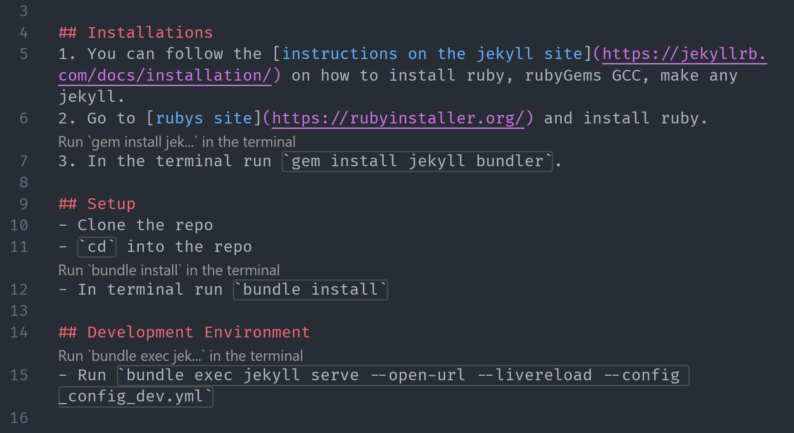

# Command Runner

With this extension, you can run code snippets from _any_ file.

## Requirements

- Visual Studio Code 1.48+

## How to Use

- By default the extention is enabled, you can toggle it using the command palette. Trigger the command palette (Ctrl / Cmd + Shift + P) -> Command Runnder: Enable / Disable.
- Once it is enabled, above every line that contains the word 'run' followed by a code snipped (e.g. run `npm -V`) appears a button to execute the command.

## To-Dos

- [ ] Work with two runnables on one line.
- [ ] Support more complex regex expressions.
- [ ] Add support for multi-line code blocks with multiple runnables.
- [ ] Support custom regex expressions.
- [ ] Add language filters.

## Release Notes

### 0.1.0

- Initial release